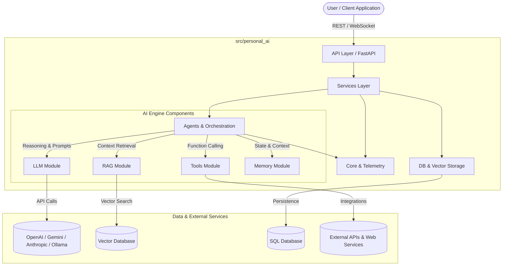
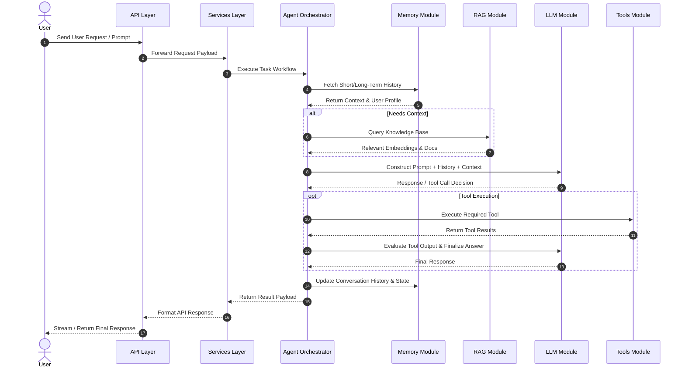

# Personal AI Assistant

An intelligent, modular, and extensible Personal AI Assistant built with Python using a production-grade architecture.

---

## 🏗️ Architecture Diagrams

### 1. High-Level System Architecture



### 2. Request & Information Flow



---

## 📁 Directory Structure

```text
personal-ai/
│
├── src/
│   └── personal_ai/
│       ├── api/          # REST, WebSocket endpoints, router controllers
│       ├── agents/       # Agent reasoning loops, graphs, orchestrators
│       ├── config/       # Pydantic settings, env configs, feature flags
│       ├── core/         # Telemetry, logging, exceptions, auth primitives
│       ├── db/           # ORM models, session setup, database clients
│       ├── llm/          # Provider client wrappers, prompt managers
│       ├── memory/       # Short-term context, persistent user memory
│       ├── models/       # Data models, domain entities, ORM schemas
│       ├── prompts/      # System prompt templates, instructions, builders
│       ├── rag/          # Embeddings, chunkers, vector store retrievers
│       ├── schemas/      # Pydantic request/response models & DTOs
│       ├── services/     # Business logic orchestration layer
│       ├── tools/        # Agent tools, search, web scrapers, integrations
│       ├── utils/        # Common helpers, string/date formatters
│       └── main.py       # Application entry point
│
├── tests/
│   ├── unit/             # Fast unit tests for components
│   ├── integration/      # End-to-end API & DB tests
│   └── evals/            # LLM & RAG retrieval accuracy benchmarks
│
├── docs/                 # Project documentation & design specs
├── scripts/              # Data ingestion scripts & utility tools
├── migrations/           # Database migration files (e.g., Alembic)
├── .env                  # Environment secrets & keys
├── pyproject.toml        # Package dependencies & configuration
└── README.md             # Project overview & architecture documentation
```

---

## 🧩 Component Roles & Responsibilities

| Module | Description |
| :--- | :--- |
| **`api/`** | Handles HTTP/WebSocket interface routing, payload validation, and request pipelines. |
| **`agents/`** | Manages autonomous task resolution loops, multi-agent communication, and state routing. |
| **`config/`** | Parses environment variables securely using Pydantic `BaseSettings`. |
| **`core/`** | Provides foundational utilities like tracing, structured logging, custom exceptions, and security wrappers. |
| **`db/`** | Manages connections and schemas for relational databases and vector stores. |
| **`llm/`** | Standardizes interaction across LLM providers (OpenAI, Gemini, Anthropic, Ollama). |
| **`memory/`** | Maintains active session state, entity memory, and user facts across sessions. |
| **`models/`** | Defines domain entities, database ORM models, and internal data structures. |
| **`prompts/`** | Houses system prompt templates, task instructions, and prompt assembly logic. |
| **`rag/`** | Controls document ingestion, semantic chunking, embedding generation, and vector retrieval pipelines. |
| **`schemas/`** | Defines strict data contracts (Pydantic DTOs) exchanged across layers. |
| **`services/`** | Connects business operations, linking API calls with DB persistence and agent processing. |
| **`tools/`** | Defines function-calling capabilities available to agents (e.g., web search, APIs, code execution). |

---

## 🚀 Getting Started

### 1. Prerequisites
- Python 3.10+
- `pip` or `uv` / `poetry`

### 2. Setup Environment
```bash
# Clone repository
cd personal-ai

# Create virtual environment
python -m venv .venv
source .venv/bin/activate  # On Windows: .venv\Scripts\activate

# Install editable package
pip install -e .
```

### 3. Configuration
Copy `.env.example` to `.env` and fill in your API keys:
```bash
cp .env.example .env
```

### 4. Running the Application
```bash
python -m personal_ai.main
```
uv run uvicorn personal_ai.main:app --reload --app-dir src