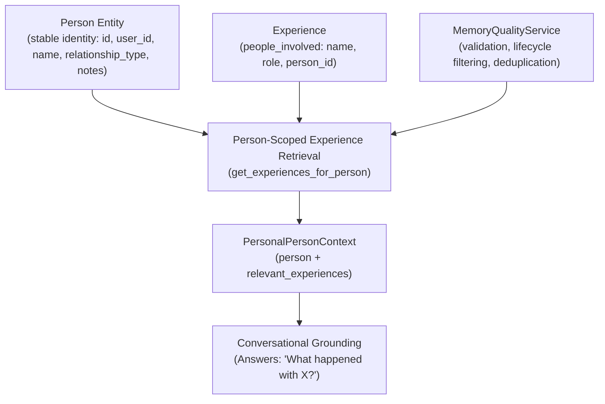

# Relationship / People Model Architecture (PR #29)

## 1. Overview & North Star

PR #29 introduces the foundational **People & Relationship Model** layer for Second Brain AI.

The purpose is to make experiences involving specific people structured, traceable, and retrievable over time, without making speculative psychological inferences, computing relationship scores, or assuming attachment styles.



> [!IMPORTANT]
> **Core Principle: Entity vs Observation vs Pattern vs Reflection**
> - **Person**: Stable entity representing someone in the user's life (`name`, `relationship_type`, `notes`).
> - **Experience**: Primary episodic evidence of an event or interaction involving that person.
> - **Pattern**: Repeated behavioral hypothesis derived from multiple distinct observations over time.
> - **Reflection**: Evidence-grounded interpretation tracking change, reinforcement, weakening, or inconsistency.

---

## 2. Distinction Between Architectural Layers

| Layer | Example | Role | PR / Module |
| :--- | :--- | :--- | :--- |
| **Person** | *"Rahul (COLLEAGUE)"* | Stable entity representing someone in the user's life. | PR #29 (`personal_ai.domain.person`) |
| **Experience** | *"I spoke with Rahul today about our quarterly deployment."* | Event/memory involving that person with temporal & emotional context. | PR #1-17 (`personal_ai.domain.experience`) |
| **Memory Quality** | Lifecycle active, deduplicated observations. | Canonical quality, deduplication, and budget filtering. | PR #26 (`personal_ai.application.memory`) |
| **Personal Pattern** | *"You tend to discuss deployment plans with colleagues on weekday mornings."* | Long-term repeated behavioral hypothesis across multiple experiences. | PR #23-24 (`personal_ai.domain.pattern`) |
| **Reflection** | *"Recent activity continues to support your established collaboration routine."* | Evidence-grounded observational tracking over time. | PR #28 (`personal_ai.domain.reflection`) |

---

## 3. Safety Invariants & False-Positive Protections

1. **Strict User Isolation**:
   - Every `Person` belongs to exactly one authenticated `user_id`.
   - All repository and service operations are explicitly user-scoped (`get_by_id(user_id, person_id)`).
   - Cross-user lookups and invalid UUIDs strictly fail closed.

2. **No Relationship Scoring or Psychological Profiling**:
   - The system **NEVER** computes:
     - `relationship_health`
     - `relationship_strength`
     - `trust_score`
     - `compatibility_score`
     - `attachment_score`
   - The system **NEVER** makes personality judgments or psychological assertions (e.g. *"Rahul is toxic"*, *"Rahul is your close friend"*) unless explicitly stated by the user.

3. **No Hallucinated Auto-Creation**:
   - `PersonService.resolve_person` searches deterministically using case-insensitive exact matching.
   - Entities are created only under explicit application control (`create_if_missing=True`).

4. **100% Backward Compatibility**:
   - Legacy experiences containing names/text without `person_id` remain valid and continue to function seamlessly.

---

## 4. Person-Scoped Retrieval Flow

```
User Query: "What happened between me and Rahul?"
       ↓
Identify / Resolve Person: Rahul (ID: abc-123)
       ↓
Fetch Experiences involving Rahul (via person_id link or exact name match)
       ↓
MemoryQualityService: validate, filter superseded/expired, deduplicate
       ↓
Assemble PersonalPersonContext (person + quality-filtered experiences)
       ↓
Conversational Context
```
