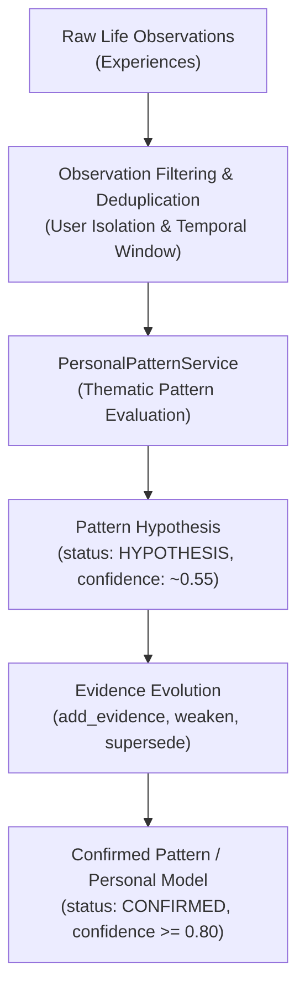
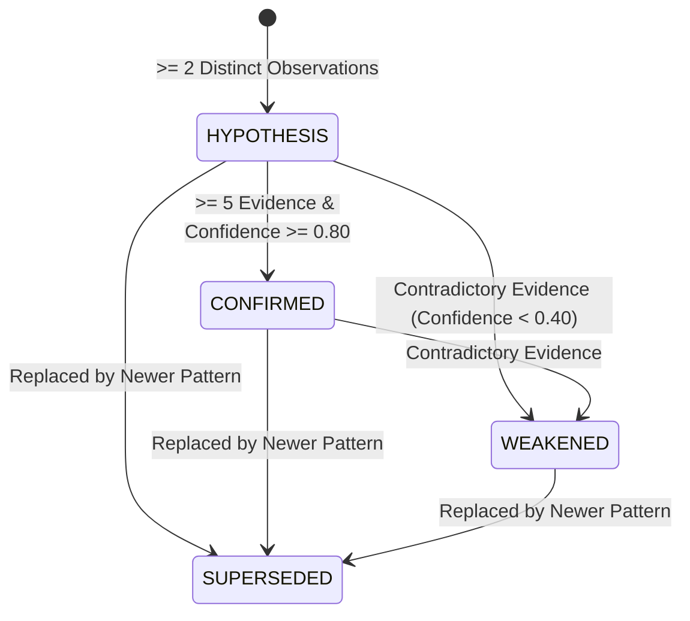

# Personal Model Architecture (PR #23)

## 1. Overview & North Star

PR #23 introduces the foundational **Personal Pattern & Personal Model** layer for Second Brain AI.

The overarching goal is to enable the system to understand the user deeply over time through conservative, evidence-based behavioral pattern hypotheses—without prematurely assuming personality traits, psychological profiles, or clinical diagnoses.



> [!IMPORTANT]
> **Core Principle: Hypothesis Over Assumption**
> $$\text{Observation} \longrightarrow \text{Repeated Evidence} \longrightarrow \text{Pattern Hypothesis} \longrightarrow \text{Confidence} \longrightarrow \text{Personal Model}$$
>
> $$\mathbf{NOT:} \quad \text{Observation} \longrightarrow \text{Personality Trait / Diagnosis} \longrightarrow \text{Fact}$$

---

## 2. Distinction Between Architectural Layers

To maintain architectural clarity and separation of concerns, the system strictly distinguishes between three layers:

| Layer | Example | Role | PR / Module |
| :--- | :--- | :--- | :--- |
| **Experience** | *"I skipped AI study yesterday."* | Primary episodic memory unit with temporal, semantic, and emotional context. | PR #1-17 (`personal_ai.domain.experience`) |
| **Proactive Signal** | *"Possible commitment/project inactivity."* | Immediate situational signal detected for potential proactive attention. | PR #22 (`personal_ai.domain.proactive`) |
| **Personal Pattern** | *"Project activity appears to become inconsistent after initial periods of activity."* | Long-term behavioral hypothesis formed from multiple distinct pieces of evidence over time. | PR #23 (`personal_ai.domain.pattern`) |

---

## 3. Safety Invariants & False-Positive Protections

1. **Minimum Evidence Rule**:
   - A single experience **NEVER** creates a `PersonalPattern`.
   - Pattern formation requires at least $\mathbf{2}$ distinct pieces of relevant evidence.
   - The system strictly prefers **NO PATTERN** over a false positive.
2. **Deduplication Invariant**:
   - Duplicate experience IDs or repeated references to identical content are collapsed and counted as single evidence.
3. **No Personality Trait Labeling**:
   - Single events (e.g. *"I didn't work today"*, *"I isolated myself once"*) never label the user (e.g., *"User is lazy"*, *"User is socially avoidant"*).
4. **No Medical / Clinical Diagnosis**:
   - The system strictly forbids psychiatric or diagnostic claims (e.g. depression, ADHD, chronic anxiety disorder, personality disorders).
5. **Observational Uncertainty Language**:
   - All pattern descriptions describe observable behavioral tendencies with uncertainty phrasing:
     - *"appears to"*
     - *"tends to"*
     - *"repeatedly"*
     - *"has been observed"*
6. **Temporal Boundedness**:
   - Experiences outside the observation window ($>90$ days without recent recurrence) do not form active recent hypotheses.
7. **Strict User Isolation**:
   - Every operation is scoped by authenticated `user_id`. Cross-user evidence linkage or pattern visibility is strictly rejected.
8. **History Preservation**:
   - Historical patterns are never hard-deleted. When refined or contradicted, patterns transition to `WEAKENED` or `SUPERSEDED`.

---

## 4. Confidence Strategy

Confidence scores are bounded in $[0.0, 1.0]$ and calculated deterministically based on distinct evidence volume and consistency:

| Evidence Count | Confidence | Status | Description |
| :---: | :---: | :---: | :--- |
| $0 - 1$ | $0.00$ | — | Insufficient evidence (no pattern created). |
| $2$ | $\sim 0.55$ | `HYPOTHESIS` | Initial conservative hypothesis. |
| $3$ | $\sim 0.65$ | `HYPOTHESIS` | Emerging pattern hypothesis. |
| $4$ | $\sim 0.72$ | `HYPOTHESIS` | Consistent pattern hypothesis. |
| $5+$ | $0.80 - 0.85$ | `CONFIRMED` | Strong repeated evidence (capped at $0.86$; never $0.99$). |

---

## 5. Pattern Lifecycle & Evolution



- **`HYPOTHESIS`**: Initial pattern state formed with $\ge 2$ distinct supporting experiences.
- **`CONFIRMED`**: Promoted only when strong repeated evidence ($\ge 5$ distinct experiences, confidence $\ge 0.80$) supports the behavior.
- **`WEAKENED`**: Demoted when contradictory evidence reduces confidence below $0.40$.
- **`SUPERSEDED`**: Retained in history with pointer to `superseded_by_id` when replaced by a more specific or updated pattern.

---

## 6. Domain Model & Persistence

### Domain Entity (`PersonalPattern`)
```python
@dataclass
class PersonalPattern:
    user_id: uuid.UUID
    description: str
    id: uuid.UUID = field(default_factory=uuid.uuid4)
    domain: str = "GENERAL"
    evidence_ids: List[uuid.UUID] = field(default_factory=list)
    confidence: float = 0.55
    status: PatternStatus = field(default=PatternStatus.HYPOTHESIS)
    first_observed_at: datetime = field(default_factory=utc_now)
    last_observed_at: datetime = field(default_factory=utc_now)
    superseded_by_id: Optional[uuid.UUID] = None
    created_at: datetime = field(default_factory=utc_now)
    updated_at: datetime = field(default_factory=utc_now)
```

### Supported Pattern Domains (`PatternDomain`)
- `CAREER`
- `FITNESS`
- `RELATIONSHIPS`
- `HEALTH`
- `PROJECTS`
- `LEARNING`
- `FINANCE`
- `SOCIAL`
- `GENERAL`

### Database Schema (`personal_patterns` table)
- `id`: UUID Primary Key
- `user_id`: UUID Foreign Key referencing `users.id` (ON DELETE CASCADE)
- `description`: Text
- `domain`: String(64) indexed with `user_id`
- `evidence_ids`: JSONB / JSON array of UUID strings
- `confidence`: Float
- `status`: String(32) indexed with `user_id`
- `first_observed_at`: DateTime(timezone=True)
- `last_observed_at`: DateTime(timezone=True)
- `superseded_by_id`: UUID nullable
- `created_at`: DateTime(timezone=True)
- `updated_at`: DateTime(timezone=True)

---

## 7. Integration & Next Steps

- In PR #23, pattern detection and persistence are decoupled and available via `PersonalPatternService` and `PersonalPatternRepository`.
- Patterns are **NOT** automatically injected into prompt context in this PR.
- Future PRs will integrate validated personal patterns into `PersonalContextRetrievalService` and `PersonalAgent` to allow nuanced, personalized assistance.
