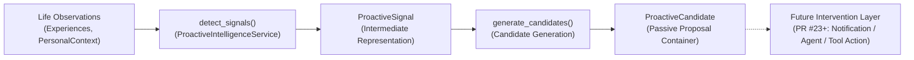

# Proactive Intelligence Architecture (PR #22)

## 1. Overview

PR #22 introduces the foundational **Proactive Intelligence** layer for Second Brain AI.

This capability moves the system from a purely reactive request-response paradigm toward observing life signals, detecting situations that may deserve attention, and generating structured intervention proposals.

> [!IMPORTANT]
> **PR #22 detects possible situations worth attention. It does not perform actions.**
> `ProactiveCandidate != Action`. The proactive intelligence service never sends messages, triggers notifications, executes tools, modifies memory, or calls LLMs autonomously.

---

## 2. Core Philosophy: Preserving Uncertainty

The proactive intelligence pipeline adheres to the principle:

$$\text{Observation} \longrightarrow \text{Signal} \longrightarrow \text{Hypothesis} \longrightarrow \text{Possible Intervention}$$

$$\mathbf{NOT:} \quad \text{Observation} \longrightarrow \text{Assumption} \longrightarrow \text{Fact}$$

### Emotional Intelligence & Safety Rules:
1. **Conservative Preference**: $\text{NO SIGNAL} > \text{FALSE POSITIVE}$ when evidence is insufficient or ambiguous.
2. **Uncertainty Ordering**: $\text{Explicit emotion} > \text{Extracted emotion} > \text{Inferred possibility}$.
3. **No Medical/Clinical Diagnosis**: The system will never state or infer diagnoses (e.g. *"You have depression"*, *"You have chronic anxiety"*).
4. **No Personality Trait Assumptions**: A temporary emotional state (e.g. *"I felt anxious today"*) remains a temporary state and is never converted into a permanent personality trait (*"User is an anxious person"*).
5. **No Causal Inferences**: Repeated temporary states are presented purely as observational occurrences (*"A similar state was recorded more than once recently"*).

---

## 3. Initial Signal Taxonomy

| Signal Type | Description | Default Priority | Confidence Range |
| :--- | :--- | :--- | :--- |
| `GOAL_INACTIVITY` | An active goal has explicit evidence of stalled progress, pause, or inactivity (age alone is never sufficient). | `LOW` | `0.70 - 0.85` |
| `COMMITMENT_MISSED` | Evidence indicates an explicit commitment has a passed deadline without completion or expected action (generic plans are not commitments). | `MEDIUM` | `0.75 - 0.85` |
| `REPEATED_STATE` | A similar mental/emotional state (e.g. `tired`, `overwhelmed`, `low energy`) has occurred repeatedly ($\ge 2$ distinct recent experiences). | `MEDIUM` | `0.70 - 0.86` |

---

## 4. Domain & Application Architecture

### Domain Layer (`personal_ai.domain.proactive`)
- **`ProactiveSignalType`**: Enum containing `GOAL_INACTIVITY`, `COMMITMENT_MISSED`, `REPEATED_STATE`.
- **`ProactivePriority`**: Bounded enum (`LOW`, `MEDIUM`, `HIGH`).
- **`ProactiveSignal`**: Domain entity representing an observed signal, reason, bounded confidence ($0.0 \le c \le 1.0$), and `related_experience_ids`.
- **`ProactiveCandidate`**: Domain entity representing a proposed intervention containing `signal_type`, `reason`, `confidence`, `priority`, `suggested_action`, and `related_experience_ids`.

### Application Layer (`personal_ai.application.proactive`)
- **`ProactiveIntelligenceService`**:
  - Deterministic, model-agnostic, in-memory execution (no LLM, no external I/O).
  - Explicit multi-stage pipeline: `detect_signals()` $\rightarrow$ `List[ProactiveSignal]` $\rightarrow$ `generate_candidates()` $\rightarrow$ `List[ProactiveCandidate]` $\rightarrow$ Deduplication.
  - Strictly user-scoped via authenticated `user_id`.

---

## 5. Security & Isolation Boundaries

- **User Isolation**: All analysis records are strictly filtered by authenticated `user_id`. Experiences or contexts belonging to other users are rejected and ignored.
- **No Side Effects**: Calling `analyze()` is a pure, read-only analysis function.
- **Decoupled Orchestration**: The service is injected independently via FastAPI dependencies (`get_proactive_intelligence_service()`) and can be composed into future background or conversational workflows.
